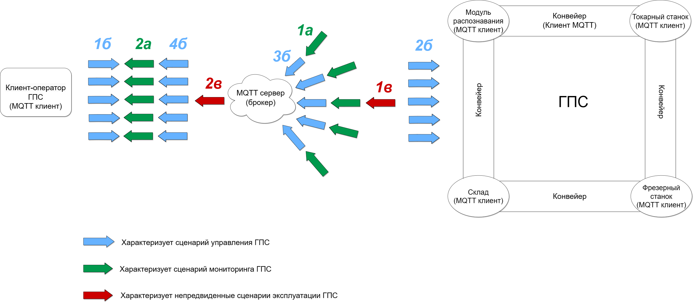

# Исходный код серверной части системы управления ГПС Denford.

## Что за проект? Какую проблему решает?
- Назначение проекта - обеспечение возможности **дистанционного управления** модулями гибкой производственной системы Denford посредством сети Интернет

 

<i>
Схематичное представление взаимодействия оператора с гибкой производственной системой
</i>

 

## В ходе выполнения проекта были выполнены следующие задачи:
1.	Была проанализирована существующая система, в результате были выявлены некоторые недостатки.
2.	Произведен анализ сетевых протоколов, выбор наиболее оптимального решения, удовлетворяющего всем требованиям, - ***протокола MQTT***.
3.	Произведен выбор платформы для реализации проекта, было принято решение проанализировать существующие облачные технологии. Основываясь на финансовых и географических факторах, выбор был сделан в пользу ***Yandex Cloud***.
4.	Разработан алгоритм взаимодействия модулей ГПС с клиентом.
5.	В ходе исследования вопроса распределенных и централизованных систем было принято решение утвердить централизованную систему в качестве дизайна системы, концепцию коммуникации клиента и ГПС реализовать, основываясь на принципах ***многопоточного программирования***.
6.	Разработан алгоритм внутренней коммуникации элементов ГПС.
7.	Произведена настройка облачного сервиса ***Yandex IoT Core***: были выписаны сертификаты формата x.509, был создан MQTT брокер.
8.	В процессе исследования наиболее часто используемых языков программирования было принято решение выбрать ***Golang*** в качестве инструмента разработки.
9.	Была организована общая структура проекта, соответствующая современным стандартам Go разработки, принципам ***Чистой Архитектуры***.
10.	 Реализован уровень ключевых доменных сущностей приложения – ***«Склад»***, ***«Конвейер»***, ***«Токарный станок»***, ***«Фрезерный станок»***, ***«Модуль распознавания»***.
11.	 Разработан уровень сервисов, инкапсулирующий основные сценарии работы приложения.
12.	 Реализован уровень работы с сетевым протоколом MQTT.
13.	 Проведено ***интеграционное тестирование*** приложения.

